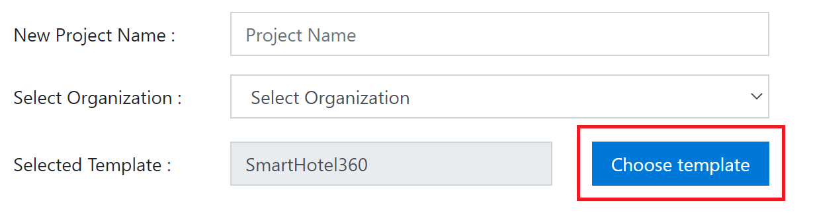
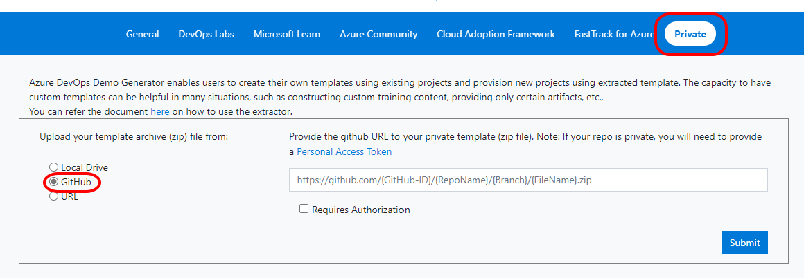
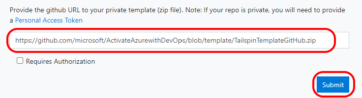
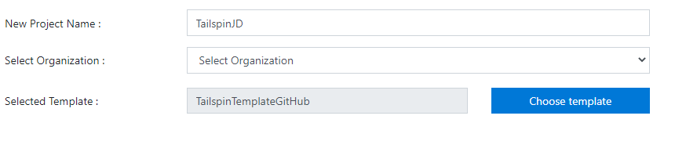
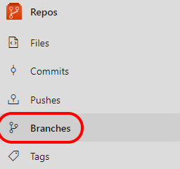
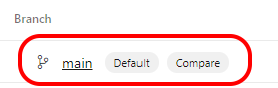
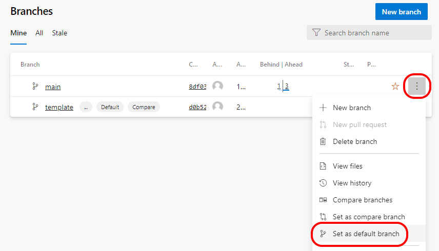

# Activate Azure with DevOps
## Module: End-to-End DevOps - Lab - End to End Prerequisite
### Student Lab Manual
**Conditions and Terms of Use**  
**Microsoft Confidential - For Internal Use Only**

This training package is proprietary and confidential and is intended only for uses described in the training materials. Content and software is provided to you under a Non-Disclosure Agreement and cannot be distributed. Copying or disclosing all or any portion of the content and/or software included in such packages is strictly prohibited.

The contents of this package are for informational and training purposes only and are provided "as is" without warranty of any kind, whether express or implied, including but not limited to the implied warranties of merchantability, fitness for a particular purpose, and non-infringement.

Training package content, including URLs and other Internet Web site references, is subject to change without notice. Because Microsoft must respond to changing market conditions, the content should not be interpreted to be a commitment on the part of Microsoft, and Microsoft cannot guarantee the accuracy of any information presented after the date of publication. Unless otherwise noted, the companies, organizations, products, domain names, e-mail addresses, logos, people, places, and events depicted herein are fictitious, and no association with any real company, organization, product, domain name, e-mail address, logo, person, place, or event is intended or should be inferred.

**Copyright and Trademarks**

© Microsoft Corporation. All rights reserved.

Microsoft may have patents, patent applications, trademarks, copyrights, or other intellectual property rights covering subject matter in this document. Except as expressly provided in written license agreement from Microsoft, the furnishing of this document does not give you any license to these patents, trademarks, copyrights, or other intellectual property.

Complying with all applicable copyright laws is the responsibility of the user. Without limiting the rights under copyright, no part of this document may be reproduced, stored in or introduced into a retrieval system, or transmitted in any form or by any means (electronic, mechanical, photocopying, recording, or otherwise), or for any purpose, without the express written permission of Microsoft Corporation.

For more information, see **Use of Microsoft Copyrighted Content** at [https://www.microsoft.com/en-us/legal/intellectualproperty/copyright/permissions](https://www.microsoft.com/en-us/legal/intellectualproperty/copyright/permissions)

Microsoft®, Internet Explorer®, and Windows® are either registered trademarks or trademarks of Microsoft Corporation in the United States and/or other countries. Other Microsoft products mentioned herein may be either registered trademarks or trademarks of Microsoft Corporation in the United States and/or other countries. All other trademarks are property of their respective owners.

## End to End Prerequisite ##
This document outlines the required steps to generate a **Tailspin Space Game** team project that includes work items, source files and pipeline definitions we will utilize in the following labs.

### Task 1: Configuring the Tailspin team project ###

1. Navigate to [https://azuredevopsdemogenerator.azurewebsites.net](https://azuredevopsdemogenerator.azurewebsites.net/). This utility site will automate the process of creating a new Azure DevOps project within your account that is prepopulated with content (work items, repos, etc.) required for the lab. For more information on the site, please see [https://docs.microsoft.com/en-us/azure/devops/demo-gen](https://docs.microsoft.com/en-us/azure/devops/demo-gen).

1. Sign in using the Microsoft account associated with your Azure DevOps subscription.

    

1. **Accept** the permission requests for accessing your subscription.

1. Click **Choose Template**.

    

1. Select **Private** from the menu and choose **GitHub** as the location.

    

1. Paste the following URL into the GitHub URL field and click **Submit**.

    > https://github.com/microsoft/ActivateAzurewithDevOps/blob/template/TailspinTemplateGitHub.zip

    

1. Select your Azure DevOps organization and enter the project name **"Tailspin"**. If others in the class are using the same organization, append your initials to the project name to prevent duplicates. 

    

1. Click **Create Project** and wait for the process to complete.

### Task 2: Set the default branch ###

1. Navigate to your new project. 

    

1. Navigate to the Branches view by clicking on **Repos > Branches**.

    

1. Ensure the **default** branch is set to **main**.

    

    If not, click on the context menu and choose **Set as default branch**.

    

