# Activate Azure with DevOps
## Module: End-to-End DevOps - Lab - Monitoring Application Performance with Application Insights
### Student Lab Manual
**Conditions and Terms of Use**  
**Microsoft Confidential - For Internal Use Only**

This training package is proprietary and confidential and is intended only for uses described in the training materials. Content and software is provided to you under a Non-Disclosure Agreement and cannot be distributed. Copying or disclosing all or any portion of the content and/or software included in such packages is strictly prohibited.

The contents of this package are for informational and training purposes only and are provided "as is" without warranty of any kind, whether express or implied, including but not limited to the implied warranties of merchantability, fitness for a particular purpose, and non-infringement.

Training package content, including URLs and other Internet Web site references, is subject to change without notice. Because Microsoft must respond to changing market conditions, the content should not be interpreted to be a commitment on the part of Microsoft, and Microsoft cannot guarantee the accuracy of any information presented after the date of publication. Unless otherwise noted, the companies, organizations, products, domain names, e-mail addresses, logos, people, places, and events depicted herein are fictitious, and no association with any real company, organization, product, domain name, e-mail address, logo, person, place, or event is intended or should be inferred.

**Copyright and Trademarks**

© Microsoft Corporation. All rights reserved.

Microsoft may have patents, patent applications, trademarks, copyrights, or other intellectual property rights covering subject matter in this document. Except as expressly provided in written license agreement from Microsoft, the furnishing of this document does not give you any license to these patents, trademarks, copyrights, or other intellectual property.

Complying with all applicable copyright laws is the responsibility of the user. Without limiting the rights under copyright, no part of this document may be reproduced, stored in or introduced into a retrieval system, or transmitted in any form or by any means (electronic, mechanical, photocopying, recording, or otherwise), or for any purpose, without the express written permission of Microsoft Corporation.

For more information, see **Use of Microsoft Copyrighted Content** at [https://www.microsoft.com/en-us/legal/intellectualproperty/permissions/default](https://www.microsoft.com/en-us/legal/intellectualproperty/permissions/default)

Microsoft®, Internet Explorer®, and Windows® are either registered trademarks or trademarks of Microsoft Corporation in the United States and/or other countries. Other Microsoft products mentioned herein may be either registered trademarks or trademarks of Microsoft Corporation in the United States and/or other countries. All other trademarks are property of their respective owners.

## Contents  
[**Introduction**](#introduction)  
[**Prerequisites**](#prerequisites)  
[**Exercise 1: Monitoring Application Performance with Application Insights**](#exercise-1-monitoring-application-performance-with-application-insights)  
[Task 1: Create and deploy a web app](#task-1-create-and-deploy-a-webapp)  
[Task 2: Verify the web app is deployed to Azure](#task-2-Verify-the-web-app-is-deployed-to-azure)  
[Task 3: Generating and reviewing application traffic](#task-3-generating-and-reviewing-application-traffic)  
[Task 4: Investigating application performance](#task-4-investigating-application-performance)  
[Task 5: Tracking application usage](#task-5-tracking-application-usage)  
[Task 6: Creating application alerts](#task-6-creating-application-alerts)  
  

## Introduction ##

Application Insights is an extensible Application Performance Management (APM) service for web developers on multiple platforms. You can use it to monitor your live web applications and other services. It automatically detects performance anomalies, includes powerful analytics tools to help you diagnose issues, and helps you continuously improve performance and usability. It works for apps on a wide variety of platforms including .NET, Node.js and Java EE, hosted on-premises, hybrid, or any public cloud. It even integrates with your DevOps process with connection points available in a variety of development tools. It can even monitor and analyze telemetry from mobile apps by integrating with Visual Studio App Center.

In this lab, you'll learn about how you can add Application Insights to an existing web application, as well as how to monitor the application via the Azure portal.

### Prerequisites ###

- This lab requires you to complete the End to End Prerequisite instructions.

**Estimated Time to Complete This Lab**  
60 minutes

## Exercise 1: Monitoring Application Performance with Application Insights ##

### Task 1: Create and deploy a web app ###

Complete this task if you were unable to complete the previous labs and do not have the web app created and deployed in Azure. If you have already deployed your web app, skip to Task 2.

1. Navigate to your project in Azure DevOps.
1. Navigate to **Pipelines | Pipelines**.

    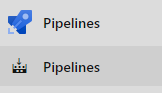

1. Click all pipelines and select the **TailspinDemo** pipeline. 

    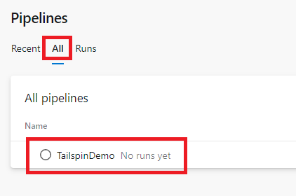

1. Next, select **Run pipeline**. 

    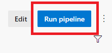

1. Ensure the **main** branch is selected and click **Run** from the menu.    

    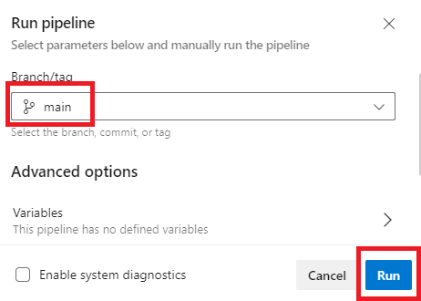

1. This will navigate to a new page with the pipeline summary view. The project is now building. You can view the logs by clicking on **Job**. Once complete, click on the **1 published** link to verify the files required for deployment are generated.

    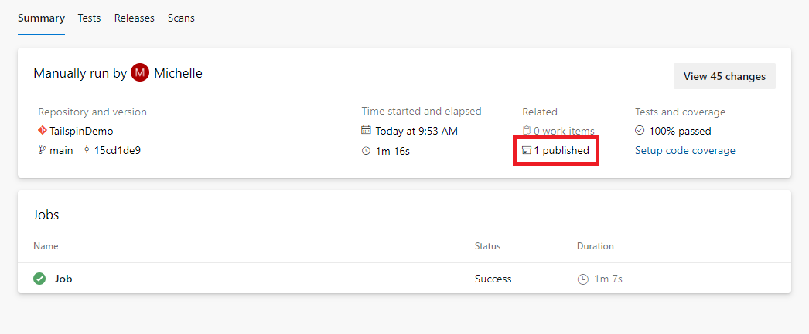
    
    
1. Next, we need to deploy the web app to Azure. Click **Releases** from the Pipelines menu.

    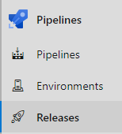

1. Select the **TailspinE2E** pipeline and click **Edit**. 

    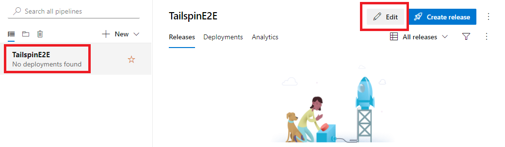

1. Click on **1 job, 2 tasks** in the Dev stage to view the tasks for this stage.

    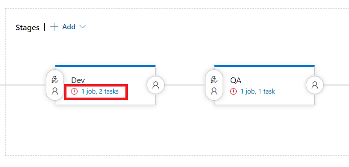

1. Click the **Azure CLI** Task and ensure an Azure subscription is provided. If not, authorize a subscription.

    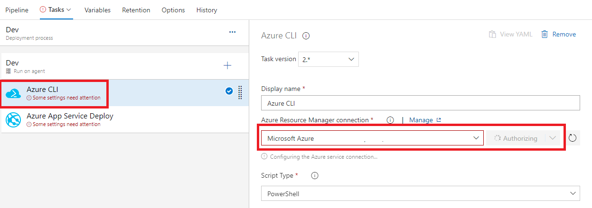

1. Click the **Azure App Service Deploy** Task and ensure an Azure subscription is provided here too. Uncheck the Deploy to slot option.

    

1. Navigate to the **QA** stage and disable the **App Service Deploy Task** by right clicking on the task. Repeat the same for **Production**. Typically, we would deploy to the different environments but since we are focused on monitoring in this lab, we will just deploy one web app. 

    
    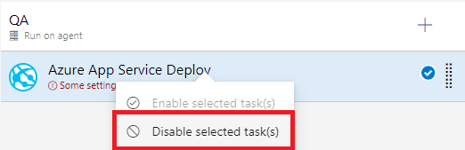

1. Select the **Variables** tab from the menu. Update the **WebsiteName** to something unique such as appending your initials at the end. 

    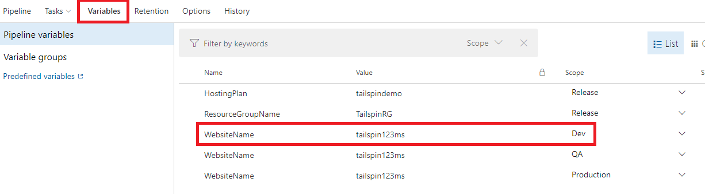

1. Click **Save** and then **Create release**.

    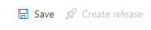

1. Accept the defaults and click **Create**.

    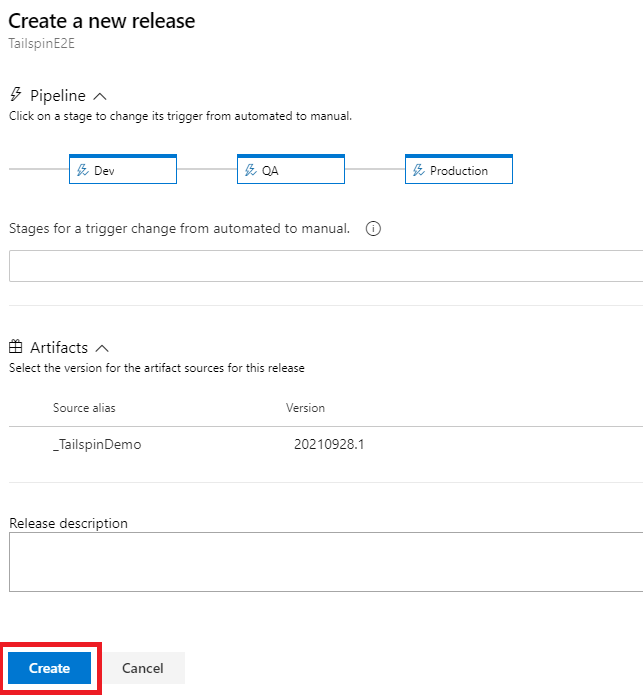

1. A banner should appear notifying us that the release has been created. Click the **Release-1** link. The web app is now deploying to Azure. You can navigate to the logs to monitor the progress. Once the release is complete, each stage should show a succeeded deployment.

    
    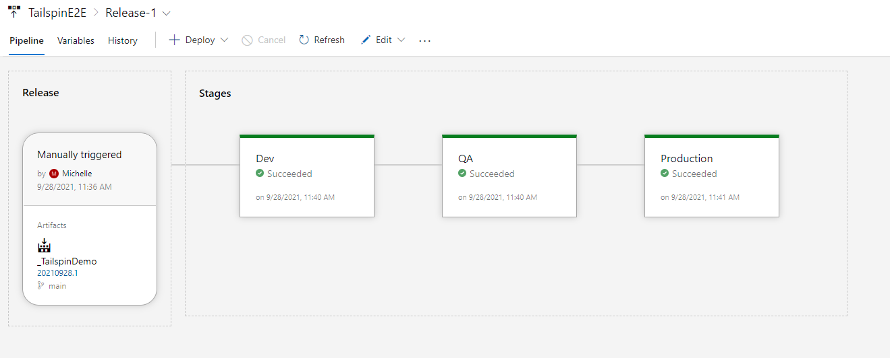

### Task 2: Verify the web app is deployed to Azure ###

1. Navigate to the Azure portal by going to https://portal.azure.com. Search for **Resource Groups**.

    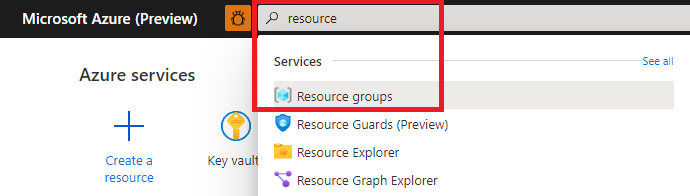

1. Select the **TailspinRG** that was created by the deployment.

    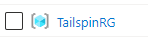

1. Verify the tailspin App Service and Application Insights are deployed. There should be three of each - one for each environment.

    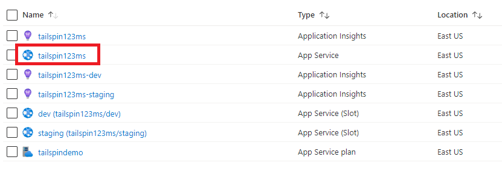

1. Navigate to the tailspin App Service and select **Browse**.

    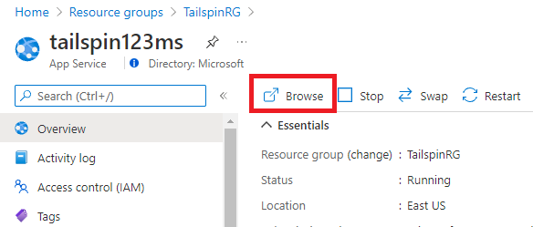

1. The Tailspin site that was deployed using the pipeline should open in a new tab. If it's not ready yet, refresh the site tab every minute or so until it loads.

    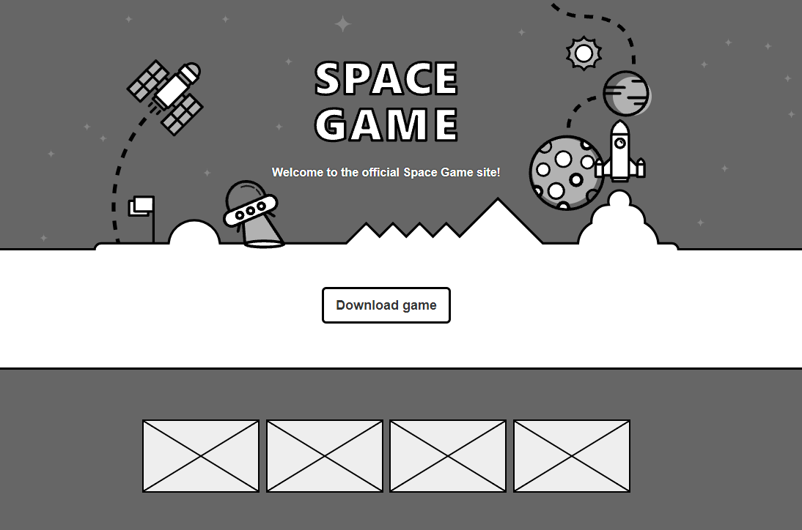

### Task 3: Generating and reviewing application traffic ###

1. Navigate around the site to produce some traffic.

1. After generating some traffic, click the **Milky Way** from the Galaxy menu item.

    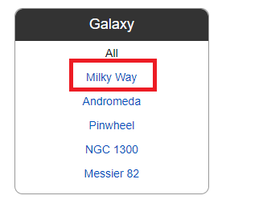#

1. Manually append a **1** to the URL and press **Enter**. This will produce a site error since that category does not exist. Refresh the page a few times to generate more errors.

    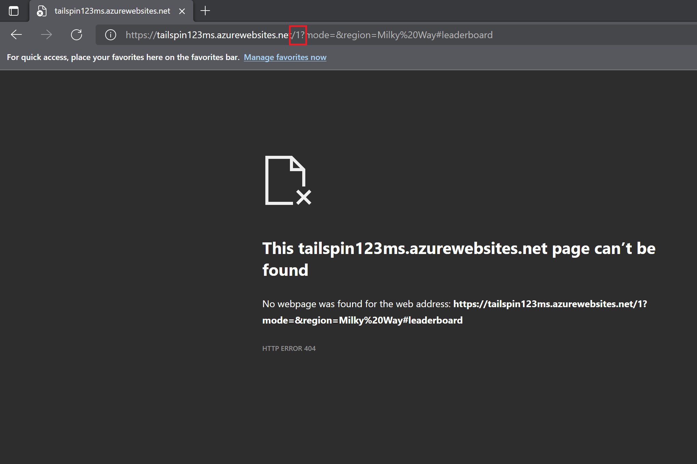

1. Return to the Azure portal browser tab.

1. Select the **Application Insights** tab.

    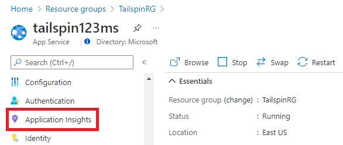

1. Click **Turn on Application Insights**.

    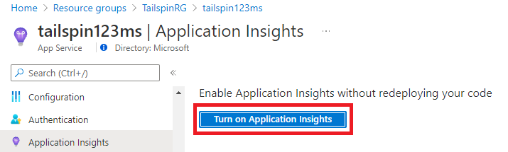

1. Click **Apply** at the bottom and **Yes** when prompted.

    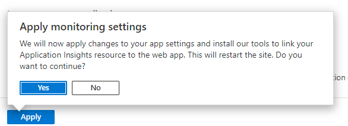

1. Click **View Application Insights data**.

    

1. The dashboard view should already have the traffic you generated earlier. If not, generate some additional traffic and refresh the data every minute or so until you see some activity in the charts. You may also need to toggle between 30 mins and 1 hour views to start to see the traffic.

    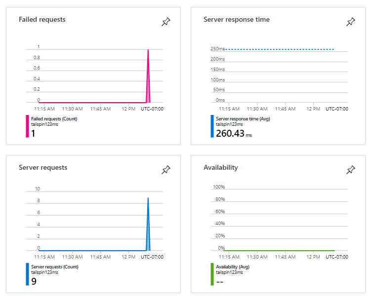

### Task 4: Investigating application performance ###

1. Select the **Application map** tab.

    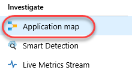

1. Application Map helps you spot performance bottlenecks or failure hotspots across all components of your distributed application. Each node on the map represents an application component or its dependencies, as well as health KPI and alerts status. You can click through from any component to more detailed diagnostics, such as Application Insights events. If your app uses Azure services, you can also click through to Azure diagnostics, such as SQL Database Advisor recommendations.

    

1. Select the **Smart Detection** tab. Smart Detection automatically warns you of potential performance problems in your web application. It performs proactive analysis of the telemetry that your app sends to Application Insights. If there is a sudden rise in failure rates, or abnormal patterns in client or server performance, you get an alert. This feature needs no configuration. It operates if your application sends enough telemetry. **However, there won't be any data in there yet since our app has just deployed.**

    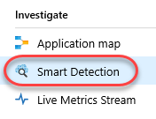

1. Select the **Live Metrics**.

    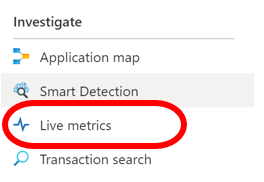

1. Return to the site browser tab and perform some navigation to produce live traffic. Generate some successful traffic with a few errors as well.

1. Return to the Azure portal tab to see the live traffic as it arrives. Live Metrics Stream enables you to probe the beating heart of your live, in-production web application. You can select and filter metrics and performance counters to watch in real time, without any disturbance to your service. You can also inspect stack traces from sample failed requests and exceptions.

    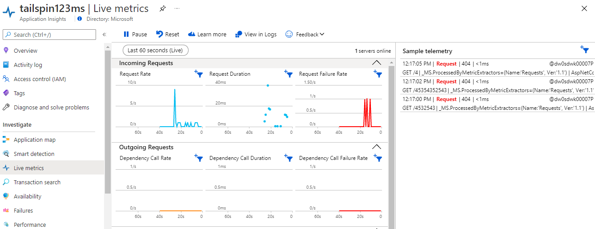

1. Select the **Transaction Search** tab.

    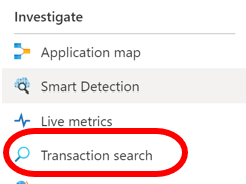

1. Search provides a flexible interface to locate the exact telemetry you need to answer questions. Click **See all data in the last 24 hours** to see data from the past 24 hours.

    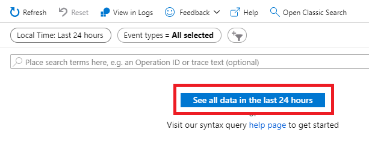

1. The results will include all telemetry data, which can be filtered down by multiple properties.

    

1. Click **Grouped results**. These results are generated based on how they share common properties.

    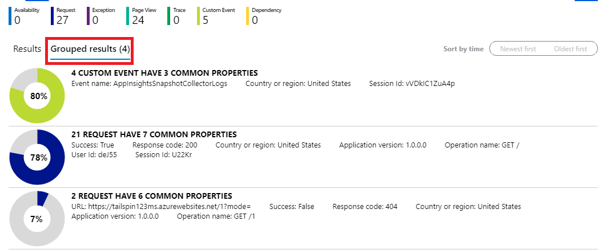

1. Expand the **Event types** dropdown.

    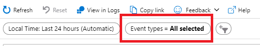

1. Deselect everything except **Request**.

    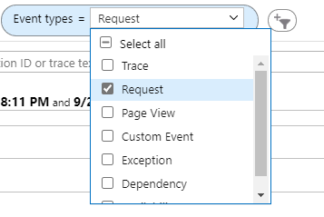

1. There should be some requests available from the traffic generated earlier. Click one of them.

    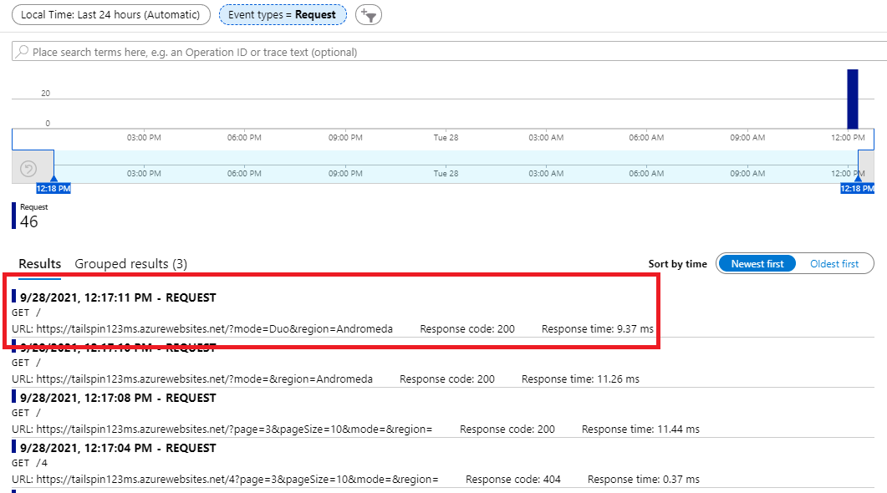

1. This will provide a full timeline view of the exception within the context of its request. Click **View all telemetry**.

    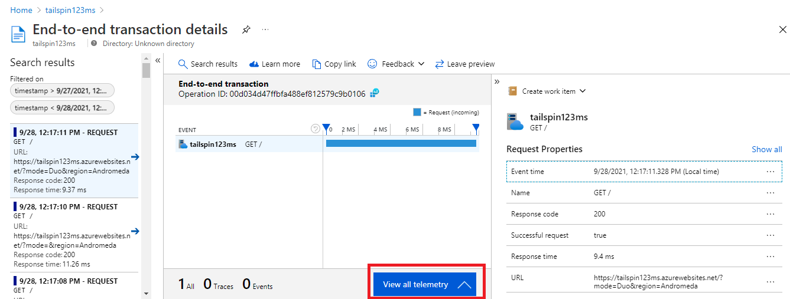

1. The **Telemetry** view provides the same data in a flat view.

    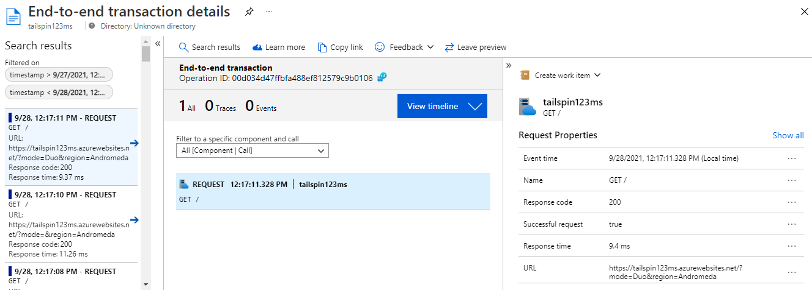

1. When selected, you can also review the details of the request itself on the right side, such as its properties and call stack.

    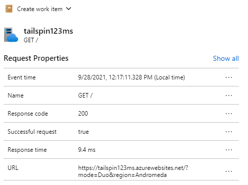

1. Close the current blade.

    

1. Select the **Availability** tab.

    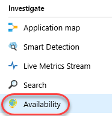

1. After you've deployed your web app or web site to any server, you can set up tests to monitor its availability and responsiveness. Application Insights sends web requests to your application at regular intervals from points around the world. It alerts you if your application doesn't respond or responds slowly. Click **Add Standard test**.

    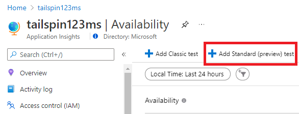

1. Enter a **Test name** of **"Home page"** and set the **URL** to the root of your site. Click **Create**.

    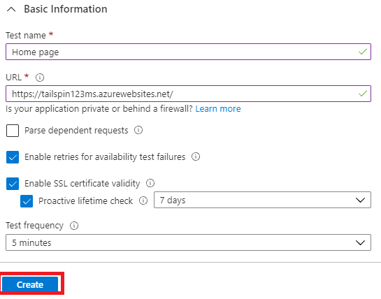

1. The test will not run immediately, so there won't be any data.

    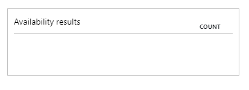

1. Click the refresh button and you should see the availability data updated to reflect the tests against your live site. Don't wait for this now if you do not see it.

    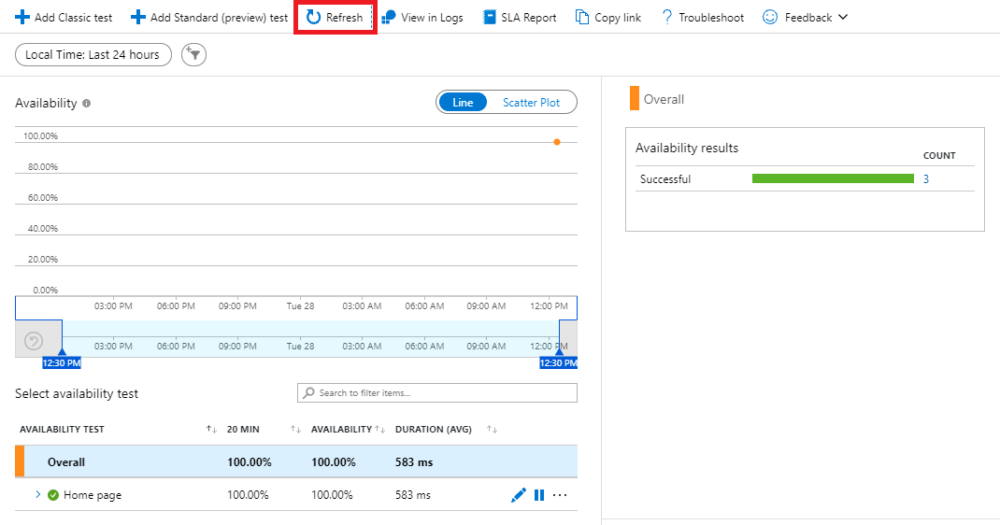

1. Select the **Failures** tab.

    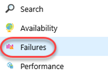

1. The Failures view aggregates all exception reports into a single dashboard. From here you can easily zero in on dependencies, exceptions, and other filters. From the **Top 3 response codes** list, click the **404** errors. If you do not see any, you will need to generate some errors on the site.

    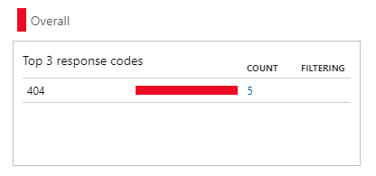

1. This will present a list of exceptions from this HTTP response code. Selecting the suggested exception will lead to the exception view covered earlier.

    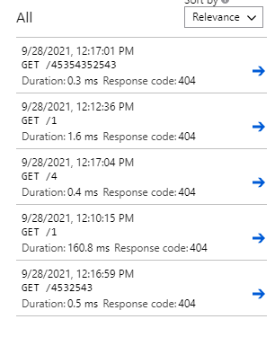

1. Close the current blade.

    

1. Select the **Performance** tab.

    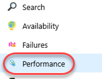

1. The Performance view provides a dashboard that simplifies the details of application performance based on the collected telemetry.

    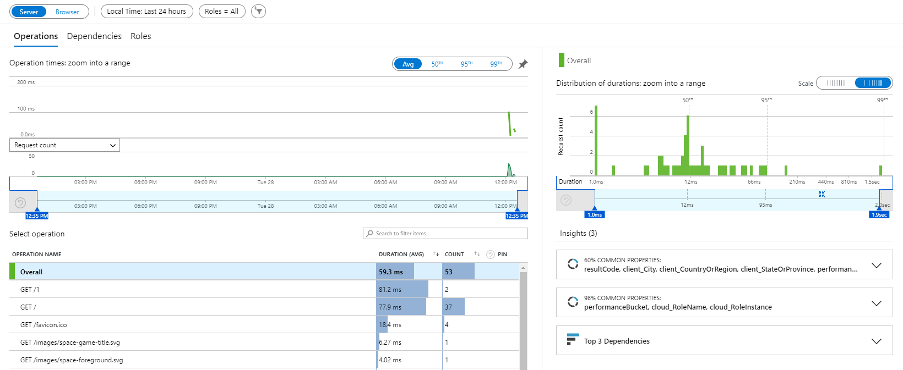

1. Select the **Metrics** tab.

    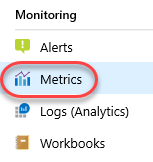

1. Metrics in Application Insights are measured values and counts of events that are sent in telemetry from your application. They help you detect performance issues and watch trends in how your application is being used. There's a wide range of standard metrics, and you can also create your own custom metrics and events. Set the **Metric** to **Server requests**.

    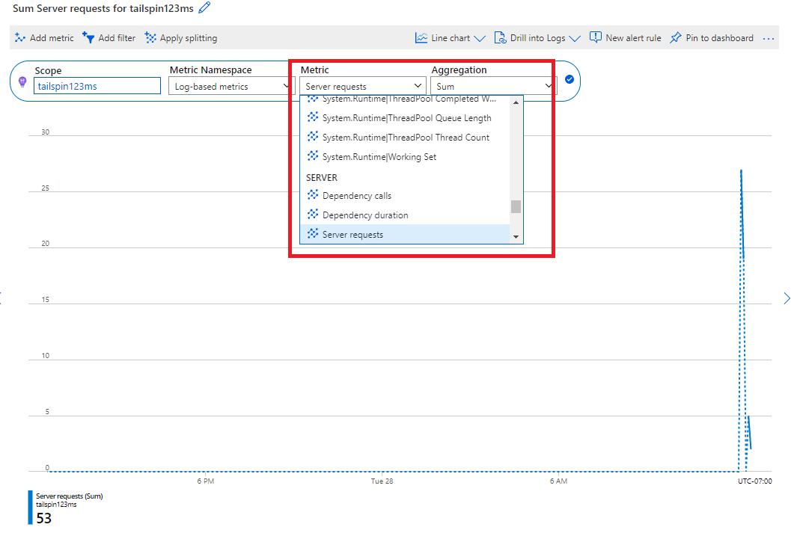

1. You can also segment your data using splitting. Click **Apply splitting**.

    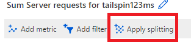

1. Set **Values** to **Operation name**. This will split the server requests by what pages they're requesting, which you can see from the different colors in the chart.

    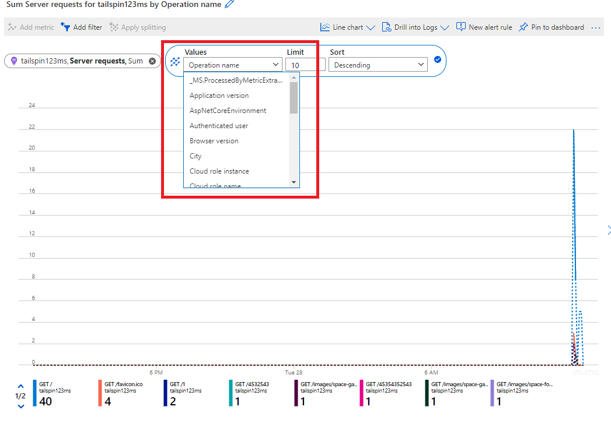

### Task 5: Tracking application usage ###

1. Application Insights provides a broad set of features to track application usage. Select the **Users** tab.

    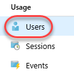

1. There aren't many users for our application yet, but we can still learn about them. Click **View More Insights**.

    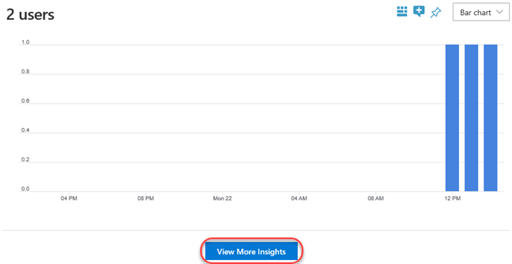

1. Scroll down to review details about the geographies, operating systems, and browsers.

    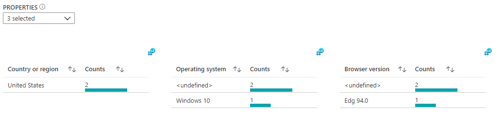

1. You can also drill into specific users to get a better understanding of their usage. Click View user timeline to open the user details.

    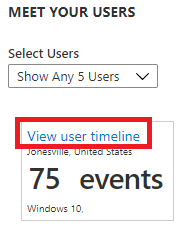
    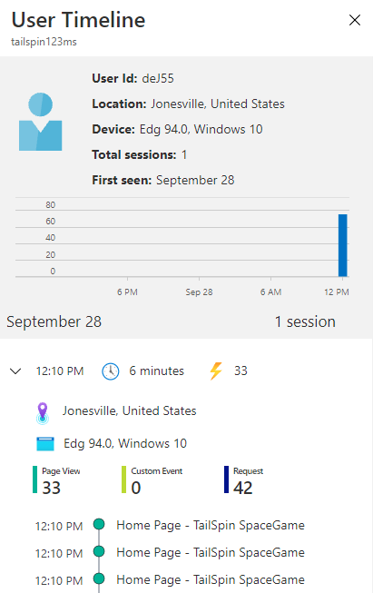

1. Select the **Events** tab.

    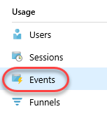

1. Click **View More Insights**.

    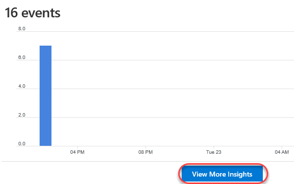

1. There will be a variety of built-in events raised so far for site navigation. You can programmatically add custom events with custom data to meet your needs.

    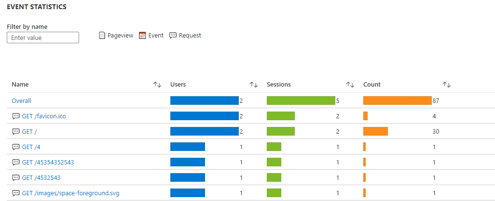

1. Select the **Funnels** tab.

    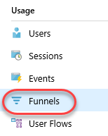

1. Understanding the customer experience is of the utmost importance to your business. If your application involves multiple stages, you need to know if most customers are progressing through the entire process, or if they are ending the process at some point. The progression through a series of steps in a web application is known as a funnel. You can use Azure Application Insights Funnels to gain insights into your users, and monitor step-by-step conversion rates. Select a top and second step and then click View to view the results.

    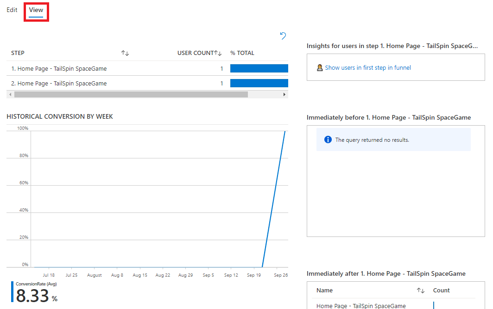

1. Select the **User Flows** tab.

    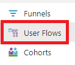

1. The User Flows tool starts from an initial page view, custom event, or exception that you specify. Given this initial event, User Flows shows the events that happened before and afterwards during user sessions. Lines of varying thickness show how many times each path was followed by users. Special Session Started nodes show where the subsequent nodes began a session. Session Ended nodes show how many users sent no page views or custom events after the preceding node, highlighting where users probably left your site. Select an event to create a user flow view.

    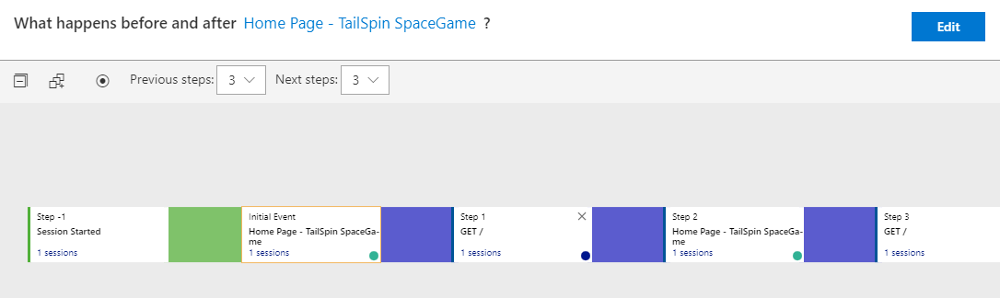

1. Select the **Cohorts** tab.

    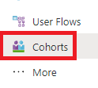

1. A cohort is a set of users, sessions, events, or operations that have something in common. In Application Insights, cohorts are defined by an analytics query. In cases where you have to analyze a specific set of users or events repeatedly, cohorts can give you more flexibility to express exactly the set you're interested in. Cohorts are used in ways similar to filters. But cohort definitions are built from custom analytics queries, so they're much more adaptable and complex. Unlike filters, you can save cohorts so other members of your team can reuse them.

    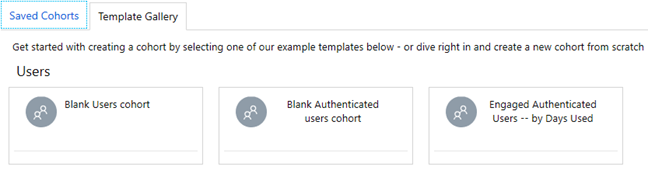

1. Select the **More** tab. This view includes a variety of reports and templates for review.

    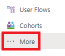

1. From the **Usage** category, select **Analysis of Page Views**.

    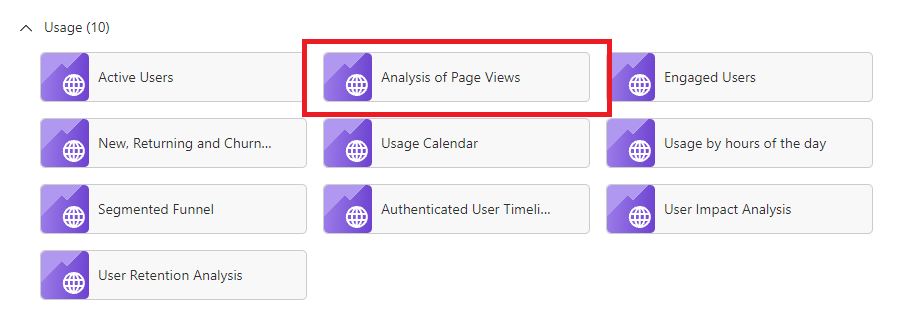

1. This particular report offers insight regarding the page views. There are many other reports available by default, and you can customize and save new ones.

    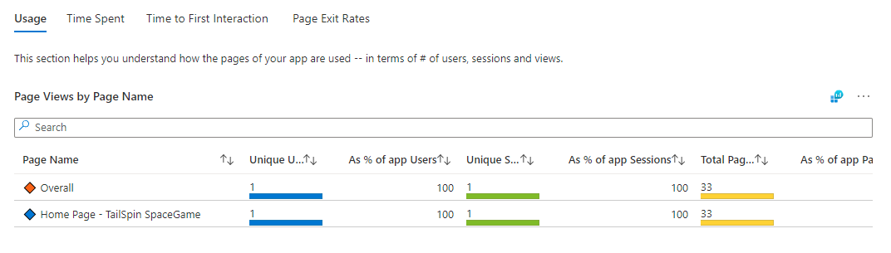

### Task 6: Creating application alerts ###

1. Select the **Alerts** tab. Alerts enable you to set triggers that perform actions when Application Insights measurements reach specified conditions.

    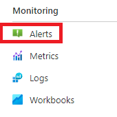

1. Click **New alert rule**.

    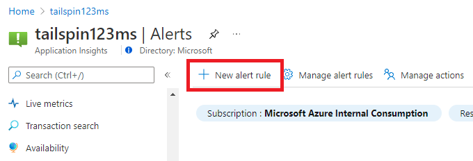

1. The current Application Insights resource will be selected by default. Click **Add conditon** under **Condition**.

    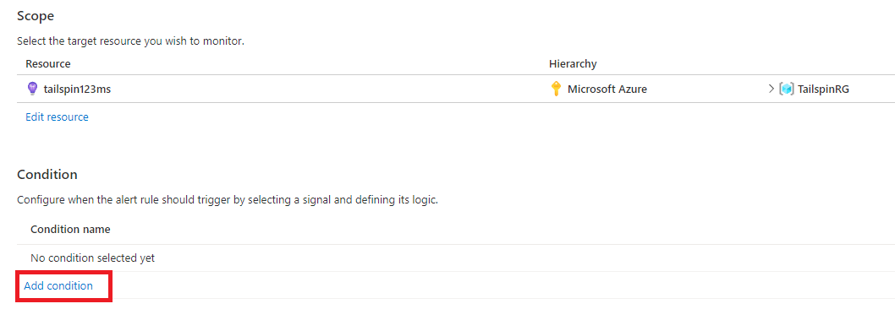

1. Search for **failed**and select the **Failed requests** metric.

    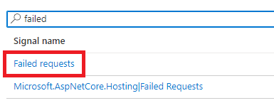

1. Set the **Threshold value** to **1**. This will trigger the alert once a second failed request is reported.

    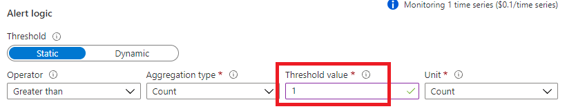

1. By default, the conditions will be evaluated every minute and based on the aggregation of measurements over the past 5 minutes. Click **Done**.

    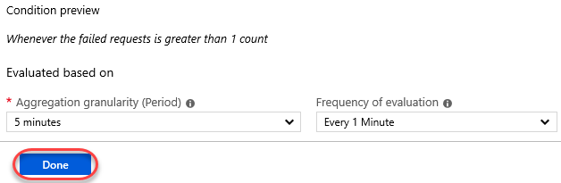

1. Now that the condition is created, we need to define an **Action Group** for it to execute. Click **Add action group** then **Create action group**.

    
    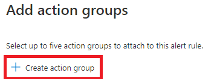

1. Set the **Action group name** and **Display name** to **"Admin alert"**. 

    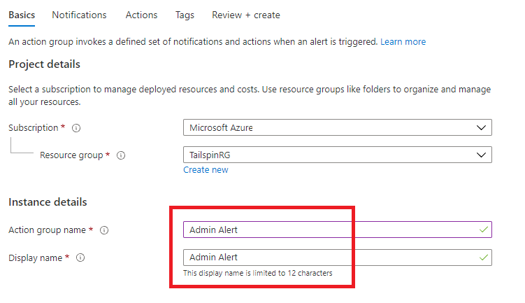

1. Select **Notifications** or **Next:Notifications >** to naviagate to the next section. Set the **Notifcation type** to **Email/SMS/Push/Voice** and **Name** to **Alert**. 

    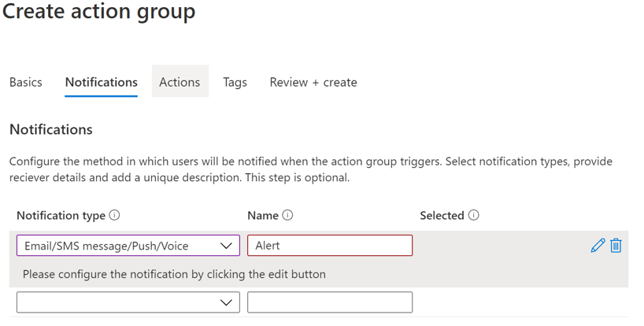

1. Click the edit pencil next to the alert. Check the **Email** box and enter your email address then click **OK**.

    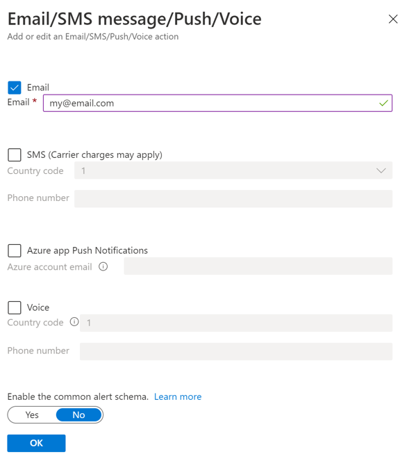

1. Click **Review and create** then **Create** to save the action group.

1. Now that the action group has been created, it may still need to be selected If not already. Click **Manage action group**.

    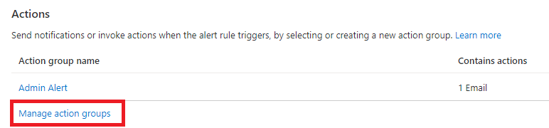

1. Check the newly created action group and click **Select**.

    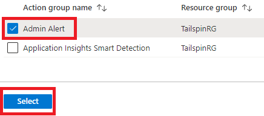

1. Set the **Alert rule name** to **"Any failure"** and click **Create alert rule**.

    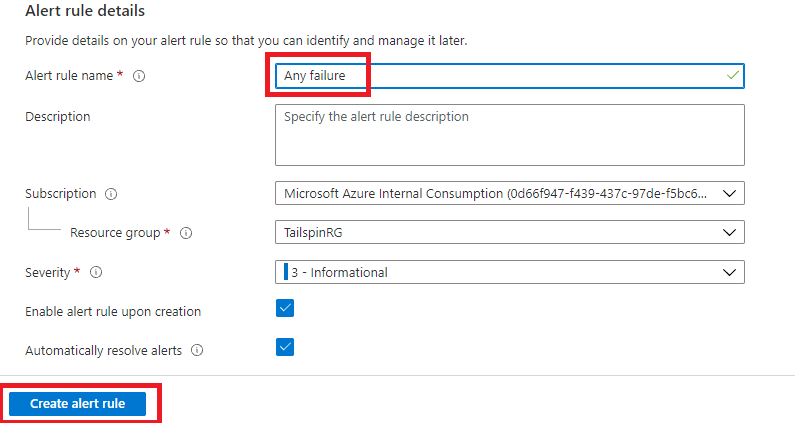

1. Once the rule has been created, return to the web site browser tab and invoke some errors using the method from earlier.

1. Around five minutes later, you should receive an email indicating that your alert was triggered.

    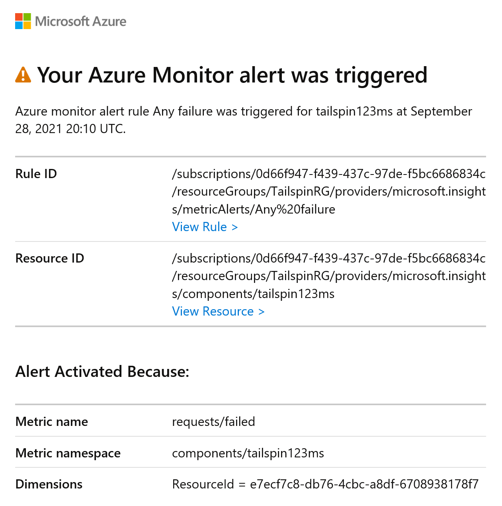

